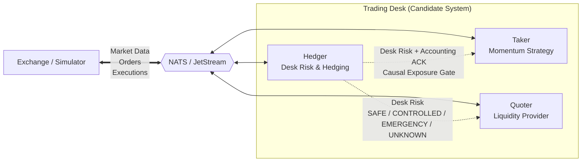

# TRV General AI Challenge 2026 - Engineering Notes

Victor Shih • Victorshih.nz@gmail.com • 4 September 2026  
Trading algorithms • risk management • distributed-system reliability • AI-assisted development

## 1. Key Engineering Lessons

This was my first real exposure to a trading system.

At the beginning I thought mainly like a trader: understand the market, improve the strategy, and try to make a profit. During implementation I realised the harder problem was building a trading system. My job was to make the Quoter, Taker and Hedger cooperate safely and correctly while keeping trading data and risk under control. In my experience, risk management comes first, and profit comes after that.

During implementation, it was easy to get deeply immersed in the details and drift away from the requirements. Especially when the simulator showed large losses, it was tempting to keep tuning parameters. I had to keep reminding myself of the main job and requirements. AI allowed me to implement code incredibly fast, but I also had to make sure the AI remained under control.

- I learned that a trading algorithm is only one part of the system. Message delay, duplicate/missing events, restart, disconnect, resource limits and race conditions can each create trading risk.
- My original time scale was mostly seconds. This was my first time dealing with microsecond / sub-millisecond event ordering, exchange timestamps and very short stale windows, where timing fundamentally changed whether a design was safe.
- I also learned that a timeout alone is not a sufficient safety model. The design moved to clear states such as UNKNOWN / SAFE / CONTROLLED / EMERGENCY to ensure a component stops taking new risk when it cannot prove that doing so is safe.

## 2. System Architecture & Role Relationships

*Figure 1: Trading Desk Architecture & Message Flow*

- Exchange events are the authoritative source of order and execution activity.
- Hedger reconstructs the combined desk position and publishes the desk-wide risk state.
- Quoter and Taker independently enforce desk risk before creating new exposure; Taker additionally waits for causal accounting ack after a fill.

## 3. Role Behavior and Risk Controls

### 3.1 Quoter (Java)

Provide passive two-sided liquidity while bounding local inventory and combined desk exposure within safe limits.

**Main Actions:**

- Reads BBO, metadata, and desk risk to calculate a central fair value and inventory-aware quote plan.
- Maintains one bid slot and one ask slot via a state machine (KEEP / CANCEL / ADD / WAIT).
- Cancels old, unprofitable, or risky quotes; replaces them only after the lifecycle state is fully verified.

**Risk Controls:**

- New exposure strictly requires trusted transport, valid BBO, and fresh, non-UNKNOWN desk risk. Expiry of the freshness window immediately revokes quoting authority.
- CONTROLLED / EMERGENCY states suppress any side that increases desk exposure. Local inventory limits are re-verified immediately prior to dispatch.
- Order lifecycle fails closed: PENDING_ADD, PENDING_CANCEL, and UNKNOWN prohibit replacement orders.

**Race-Condition Handling:**

- Cancel/Replace Race: Scheduled cancellations block new ADD orders in the same cycle. Replacements await authoritative EMPTY confirmation to prevent double-live orders.
- Disconnect/Reconnect Race: Transport recovery does not automatically restore trading trust; BBO and risk trust are reset and must be explicitly re-established.
- Risk/Lifecycle Re-evaluation: The evaluator can verify risk expiry without erroneously treating an unchanged BBO as new market data.

### 3.2 Taker (Python)

Retain the original momentum strategy but strictly halt new trades if system risk data is stale or missing.

**Main Actions:**

- Maintains recent mid-price history to trigger the legacy THRESH / LAG momentum rule.
- Crosses the spread using FAK (F) orders at executable BBO prices.
- Broadcasts local states for monitoring (desk position is updated solely by actual trade executions).

**Risk Controls:**

- New exposure requires trusted transport and fresh SAFE desk risk; CONTROLLED, EMERGENCY or UNKNOWN states instantly block exposure.
- A secondary atomic readiness check occurs immediately before request dispatch.
- Timeouts or conflicting evidence trigger a fail-closed halt on new exposure, rather than assuming zero fills.

**Race-Condition Handling:**

- Stale-SAFE Burst: Following a fill, subsequent exposure is blocked until: (1) local authoritative T execution is observed, (2) Hedger acknowledges the match/quantity, and (3) a related/newer risk publication is observed.
- Freshness vs. Causality: A newer risk sequence heartbeat does not automatically prove a prior execution was accounted for.
- Execution Correctness: The code validates order ownership, extracts exact fill quantities from the exchange, and applies correct signed SELL accounting.

### 3.3 Hedger (Python)

Operate as a pure risk-reduction algorithm (not an Alpha strategy) to keep combined desk position low.

**Main Actions:**

- Reconstructs position from retained execution evidence and tracks live execution feeds across all three seats.
- Calculates total desk position, evaluates risk tiers, and publishes SAFE / CONTROLLED / EMERGENCY / UNKNOWN status.
- Submits immediate risk-reducing FAK orders based on market prices and urgency when safe limits are exceeded.

**Risk Controls:**

- Authoritative position relies exclusively on validated T/E execution events; request replies (Y) never mutate accounting.
- Accounting uncertainty, malformed identities, dedup-capacity exhaustion, or uncertain hedge outcomes degrade trading authority to UNKNOWN.
- Hedge sizing is bounded by executable BBO volume, metadata limits, Hedger position limits, desk exposure, and TPS constraints.

**Race-Condition Handling:**

- Startup Replay/Live Overlap: Subscribes to live feeds before replaying retained history, utilizing deduplication to seamlessly handle overlaps.
- Multiple Hedge Race: Restricts operations to one unresolved hedge at a time; staged reductions await new authoritative evidence or new BBO generations.
- Restart Ambiguity: The system remains unready until position recovery finishes and the initial risk state is published.

## 4. Development Approach & AI Workflow

I started with a two-agent model. ChatGPT helped plan the system architecture, I gave my own view to lead the direction, and discussed detailed logic, algorithms and exception control and other aspects. Before implementing the code it generated full implementation/testing plan and supporting documents, and also acted as a code reviewer. Copilot focused on code implementation. I remained the final decision maker and manually managed Git, Docker, runtime probes and final validation.

- The original approach used detailed architecture plans and long sessions. It consumed context/tokens quickly and made code review more complicated.
- I moved to smaller jobs: inspect -> agree on one invariant -> implement -> focused test -> broader regression -> runtime evidence -> review -> stop. I also moved more Git/Docker/evidence operations back to manual control.
- AI output was treated as a proposal, and agents could not claim a local PASS unless I supplied the actual output. I challenged assumptions and avoided premature conclusions. For complex logic, I sometimes used two AI systems to cross-check each other, then made the final decision.

## 5. Key Building

### 5.1 Trading Algorithms

- Quoter: Pricing and inventory logic are decoupled from execution lifecycles and desk risk. I relied on controlled experiments rather than tuning multiple pricing variables simultaneously.
- Taker: The production system retains the supplied momentum Alpha. I prioritized correctness, protocol compliance, and risk integration before any bounded Alpha testing.
- Hedger: Optimized strictly for risk reduction over market prediction. It classifies exposure, selects the reducing side, sizes staged FAK orders, and waits for authoritative execution evidence before re-evaluating.

### 5.2 Risk Management

- Risk is treated as an emergent desk-wide property, not an isolated Hedger responsibility.
- Hedger owns authoritative desk state; Quoter and Taker consume it to suppress new exposure when unsafe or unknown.
- When the system cannot prove recovery, I prefer reduced availability over inventing state.

### 5.3 Resolving Ambiguity

Before changing production behaviour, I used small controlled probes directly against the exchange binaries to verify assumptions.

| Ambiguity Concept | Engineered Resolution |
|---|---|
| Source of Truth | Employer specs (TASK, REQUIREMENTS, PROTOCOL, CHANGELOG) > Runtime evidence > Internal notes. |
| Unknown != Zero | Missing/stale risk, disconnects, malformed executions, or failed recoveries never assume position is flat. |
| Freshness != Causality | A newer heartbeat sequence does not prove prior fills were accounted for. |
| Receipt != Causal Order | Different NATS subjects can be observed out of order relative to the sequence inside a strategy process. |

## 6. Risk Control Highlights

### 6.1 Causal Barriers & State Synchronization

- Taker Causal Barrier: Initially, the Taker over-submitted orders before previous fills were processed. Fixed by requiring Execution Confirmation + Hedger Accounting Ack + Updated Risk Evidence before placing new orders (Fresh data != Causally complete data).
- Quoter State Synchronization: Asynchronous events caused redundant market data re-evaluations. Resolved using RuntimeState for atomic snapshots (BBO + risk) and version tracking, preventing the EWMA filter from double-counting prices.

### 6.2 Final Validation Benchmarks

| Metric | Benchmark Result | Target Bound |
|---|---:|---:|
| Max Absolute Desk Position | 8 | 15 (Hard Limit) |
| Emergency Seconds | 0.0s | 0.0s |
| Fatal Errors | 0 | 0 |

## 7. Distributed-System Reliability

Many of the most challenging edge cases involved race conditions or loss-of-knowledge events rather than ordinary programmatic exceptions.

- Delay, duplicate delivery, malformed/missing evidence, timeout, disconnect, and restart possess distinctly different semantics. A generic timeout cannot safely solve all of them.
- Silently evicting deduplication evidence via LRU caching was deemed unsafe for authoritative execution accounting. Capacity exhaustion now deliberately causes loss of trust and fail-closed behaviour.
- NATS transport reconnection does not equate to accounting recovery. Components must rebuild sufficient authoritative state before exposure is re-authorized.

## 8. Taker Research

### 8.1 Markout & Execution Economics

The supplied Taker remains a momentum strategy in production. While I fixed confirmed protocol defects and integrated desk-safety gating, I intentionally did not replace its core THRESH / LAG rule.

Repeated trading evidence identified the Taker as the most consistent source of public-simulator desk losses. Profitability diagnosis separated crossing costs from post-fill movement.

| Taker Loss Source | Metric Impact |
|---|---|
| Crossing Costs | Immediate execution edge was heavily negative. |
| Adverse Movement | 1s markout averaged -16.8 ticks; 5s markout averaged -23.1 ticks. |

### 8.2 Causal Signal Reconstruction & Spread Gate

I discarded an earlier counterfactual analysis that relied on cross-subject message timing due to causality flaws. Reconstructing triggers using executable request prices and production-level triggers yielded superior insights.

Finding: Spread was the strongest simple discriminator.

| Metric | All Fills | Fills with Spread <= 10 |
|---|---:|---:|
| 1s Markout | -17.0 | -5.6 |
| Retained Trades | 100% | ~60% (303 / 503) |
| Retained Qty | 100% | ~62% (905 / 1462) |

Decision: I approved a bounded experiment to keep the original momentum trigger but block new Taker exposure when spreads exceed a maximum limit. Although preliminary results were highly promising, I chose not to ship the change to avoid overfitting to the sample simulator, which could break behaviour in the private grading market.

## 9. Quoter Research

The original Quoter utilized 0.8 * bid + 0.2 * ask as the starting BBO valuation. Because this introduces a deterministic downward component relative to a standard midpoint, I treated it as a hypothesis to test rather than assuming it caused overall losses.

### Controlled 50/50 Experiment

I executed a single-variable production change: BID_WEIGHT 0.8 -> 0.5 and ASK_WEIGHT 0.2 -> 0.5. All other logic (EWMA, imbalance adjustment, inventory skew, minimum edge, risk logic) remained untouched. Matching strategy tests passed 208/208 before the repeated benchmark.

| Metric | Baseline (80/20) | Experiment (50/50) |
|---|---:|---:|
| Average Quoter PnL | -2,321.33 | -2,330.17 |
| Mean TWAP Position | -4.935 | -2.899 |
| Time Short (%) | 98.9% | 80.9% |
| 10s BID Markout | +2.936 | -1.218 |
| 10s ASK Markout | -8.737 | -3.911 |
| Worst Max Desk Position | 8 | 8 |

Conclusions:

- 50/50 materially improved inventory neutrality and eliminated the extreme BID/ASK asymmetry.
- Average public-simulator Quoter PnL remained unchanged, rejecting the hypothesis that 80/20 was the primary driver of losses.
- I retained the neutral 50/50 starting valuation because it removes an avoidable fixed directional bias without weakening measured risk or reliability, ceasing further sample-specific tuning.

The final Quoter remains predominantly passive, with 99%+ of observed execution quantity originating from resting fills in repeated runtime measurements.

## 10. How I supervised AI

I used AI agents to rapidly learn HFT concepts like markout, adverse selection, and event-ordering risk, but the most valuable insights came from treating AI outputs as testable hypotheses rather than facts.

Examples:

- Taker counterfactual that mistook NATS receive timing for causal order, and rejected the assumption that a heartbeat sequence equaled an accounting acknowledgement.
- During the 50/50 diagnosis, an AI analysis tool applied an outdated 80/20 bias formula. I rejected its derived interpretation and relied strictly on raw markout data.
- When an AI-assisted PowerShell script unexpectedly modified a Java test file, I paused the experiment to run a strict diff/contamination audit.
- Final checks exposed bugs in the AI's validation scripts (e.g., Docker context parsing). I corrected the tools rather than altering healthy code.

## 11. Maintainability

I strictly maintained the separation of strategy changes from exchange and risk correctness.

- Quoting policy, exchange integration, lifecycle/accounting and desk-risk coordination are separated, so a pricing experiment does not need to rewrite the safety machinery.
- Runtime behavior relies on exchange metadata and environment configuration rather than hardcoded constants.
- Raw NATS logs, structured status, and replay probes are preserved as audit evidence.

## 12. Limitations and Scope Decisions

- Public Simulator PnL: The final Quoter remains negative under public simulator flow. While the 50/50 experiment improved inventory balance, it did not eliminate adverse selection, and I make no claims to the contrary.
- Availability vs. Correctness: Certain restart paths intentionally remain fail-closed rather than attempting to recover from incomplete evidence, sacrificing availability to guarantee correctness and capital preservation.
- Sample Market Independence: I deliberately avoided adding complex HFT signals or continuing sample-specific Alpha tuning prior to submission, as the available evidence is insufficient to prove portability to the private grading market.
- Legacy Taker Scope: The Taker is part of the desk and therefore my responsibility, but its core momentum Alpha was not rewritten solely to optimize performance in a single sample environment.

## 13. Future Work

If this work were to continue as a production research project:

- Taker Strategy: Validate the research-only spread gate across broader, independent market regimes to prove portability before shipping to production.
- Quoter Enhancements: Investigate common adverse-selection mechanisms independently of the starting fair value (e.g., fair-value response speed, bounded side-specific execution buffers).
- State Recovery: Develop an authoritative snapshot reconciliation system to safely resume operations after prolonged transport outages, allowing UNKNOWN states to recover without assuming zero positions.

Final Thoughts: I completed the challenge generating more hypotheses than I started with. I chose not to implement all of them, drawing a strict line between an interesting hypothesis, sufficient evidence for testing, and sufficient evidence to ship to production. For this submission, new Alpha development is frozen, preserving the research evidence, rejected approaches, runtime validations, and the core reasoning that yielded the final resilient desk design.
